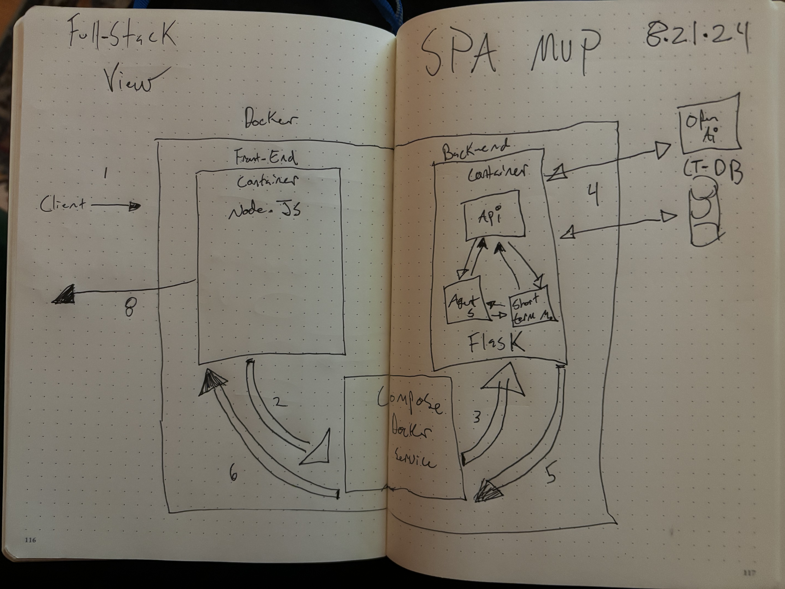
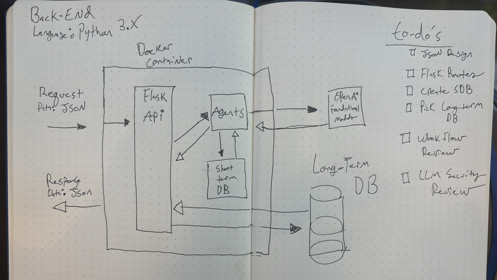

# ai_security_ed_app_24

## Full-Stack Framework



### Backend Framework



### Frontend Framework


### Basic File Structure

```txt
main-web-app/
│
├── backend/
│   ├── .env
│   ├── Dockerfile
│   ├── app/
│   │   ├── agent.py
│   │   ├── app.py
│   │   └── utils/
│   └── environmet.txt
│
├── frontend/
├── docker-compose.yml
```
